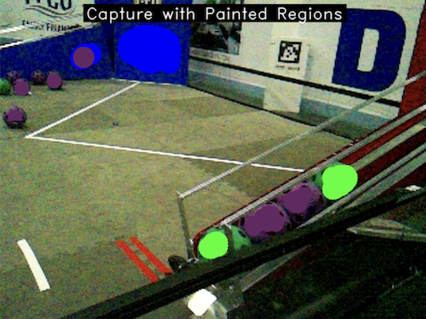
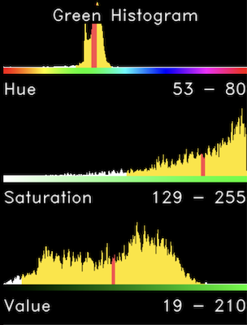
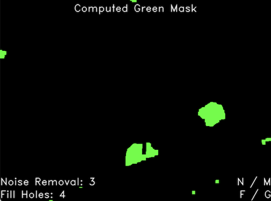
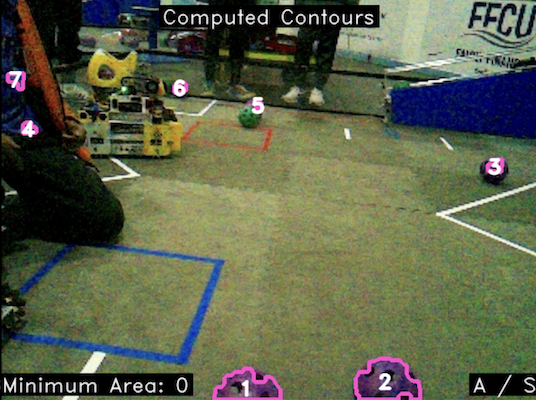

# What is Joe Paint?

Joe Paint is a general purpose calibration tool created by Joe Bots White #13702 for FTC and FRC FIRST robotics teams that allows them to quickly and easily calibrate a Limelight camera to identify game pieces by color. Calibration is hard so we created this tool to automate the process. It computes thresholds for hue, saturation, and value using histograms and statistics such as the mean and standard deviation, and provides an interactive way to adjust parameters for removing noise, filling holes, and filtering out small contours.

To use Joe Paint you will first need to take snapshots with your [Limelight](https://limelightvision.io/) camera. 
* Connect your Limelight to your computer using a USB cable
* Navigate to [http://limelight.local:5801](http://limelight.local:5801)
* Select the **Input** tab and change the source type to **Camera**
* Click the **Take Snapshot** button to save up to 32 snapshots on the camera
* Download snapshots to Joe Paint's **snapshots** folder by changing the source type to **Snapshot** and clicking the capture download buttons.

# Installing

Joe Paint is a Python 3 program that uses a number of Python packages (e.g. cv2, numpy and astropy). First
install Python 3 and related packages by running the install script.

## macOS
First install python3 by running it from the command line. If it is not installed macOS will over to install the developer tools for you.
/usr/bin/python3

Next install required packages
installPackages.cmd

## Windows
TODO

# Running

* run _JoePaint.cmd_ from the command line or
* double click _JoePaint.command_ (macOS) or
* configure your Python IDE (e.g. [PyCharm](https://www.jetbrains.com/pycharm/)) to run _source/main.py_ with the working directory set to the **JoePaint** folder.

TODO - Windows

At the top left of the Joe Paint interface you'll see the current captured image. 

By clicking to paint on portions of each captured image you can teach the computer what particular colors look like. First select a color using the 1-5 keys.
Move the cursor over **Capture with painted regions** at the top left and click and drag to paint on objects of the current color.

Use the + and - keys to adjust the brush size and the space bar to change the brush shape.

In the **Sampled Pixels** visualization you can see highlighted pixels that the program will sample to compute the threshold ranges. Use the 6 key to switch to the eraser tool or click within the **Sampled Pixels** visualization to erase regions that were marked by accident.

Use the [ and ] or the left and right arrow keys to switch between different snapshots. The computer gets better at identifying colors the more you paint and use by using additional captured images.

Joe Paint calculates histograms, shown at the top right, that represent the number of times each hue, saturation, and value is observed in the sampled pixels across all captured images. It computes the mean (or average), which is shown with a red line, to find the center of each peak. It uses the circular mean for hue since some colors, like red, wrap around the numerical origin. The thresholds for hue, saturation, and value are computed by adding and subtracting 2 standard deviations from the mean. These define the ranges shown in yellow.

Using these thresholds, Joe Paint computes the color mask that should be used to identify pixels for a particular color. Unfortunately the computed mask can contain noise, which can be removed by eroding and then dilating. Adjust the number of steps by tapping the N and M keys. Holes in the mask can be filled by dilating and then eroding. Adjust the number of steps by tapping the F and G keys.

With the cleaned up mask Joe Paint can locate objects by computing contours. Small contours can be filtered out by computing their area. Adjust the minimum area using the A and S keys.

Tap R at any time to clear all painted pixels and reset the number of steps for removing noise, filling holes, and the minimum contour area.

Tap Q or Escape to quit and write out the calibration settings to a _calibration.json_ file.
